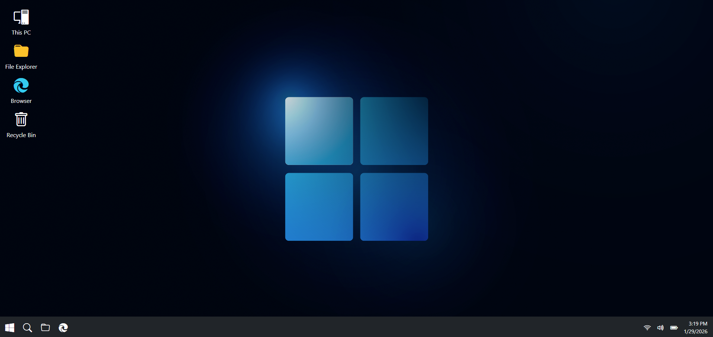
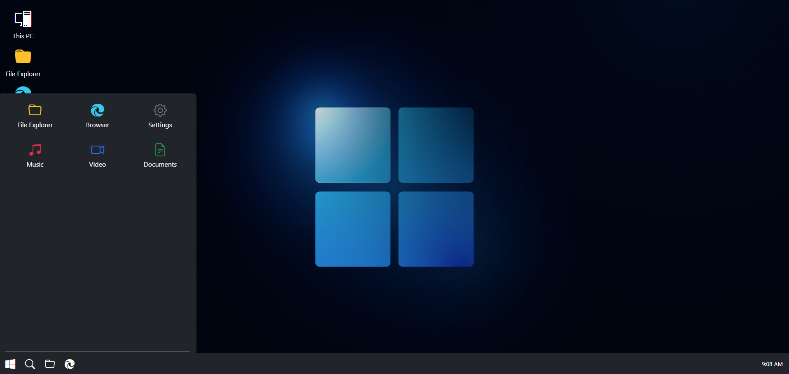
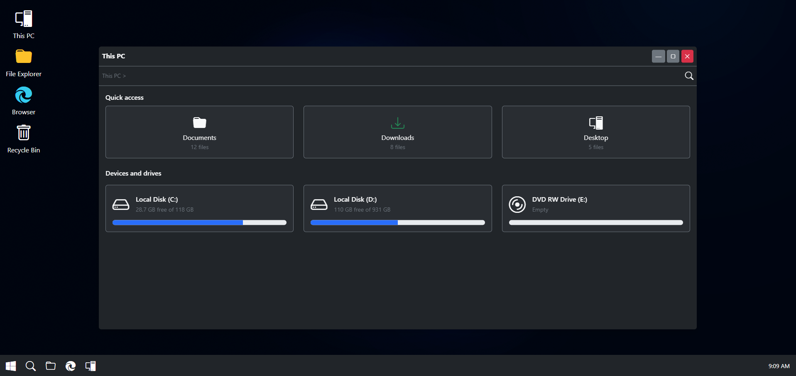
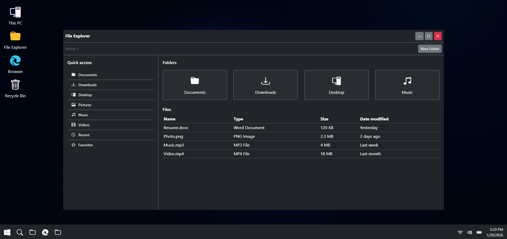
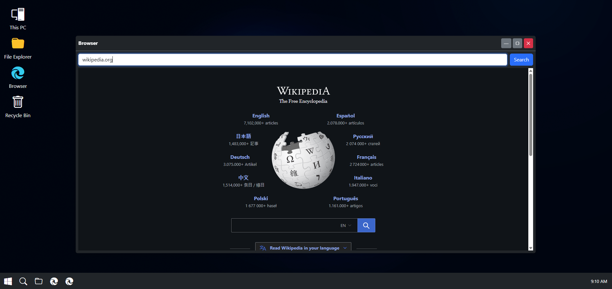
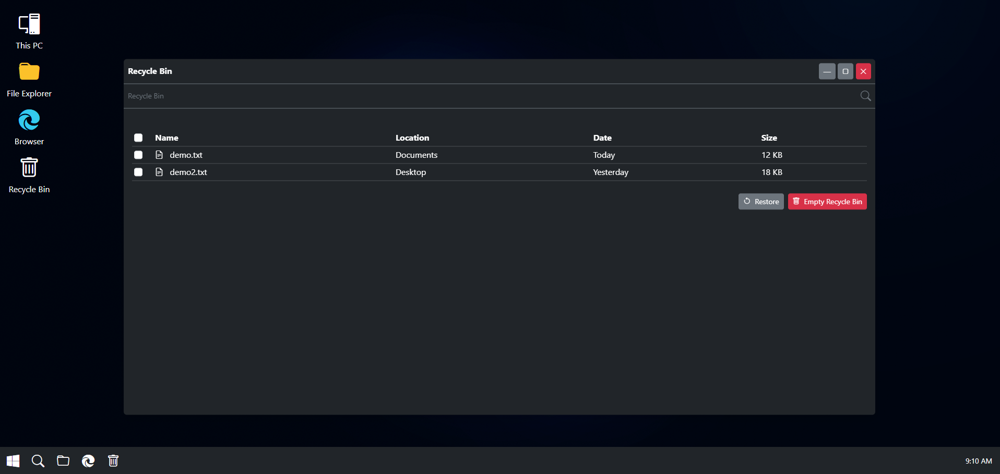

# ⭐ Windows 11 UI ⭐

Experience a fully functional **Windows 11** directly in your browser. This project replicates core Windows 11 UI
elements and interactions, including a dynamic desktop, taskbar, start menu, search, draggable app windows, and basic
applications like This PC, File Explorer, Recycle Bin, and Browser. It’s designed as a learning tool and a showcase of
web-based UI emulation. Explore the immersive Windows 11 experience, interact with apps, and see how desktop
functionalities can be recreated entirely in the browser

## 🛠️ Technologies

✅ HTML 
✅ CSS 
✅ JS 
✅ Bootstrap 
✅ JQuery 

## 🚀 Features

✅ Desktop UI: Full-screen background, left-aligned icons, draggable apps. 
✅ Taskbar: Centered icons, start menu, live clock, active app highlighting. 
✅ Start Menu: Windows 11 style popup with app grid and power buttons. 
✅ Draggable App Windows: Rounded corners, minimize, maximize, close, and focus handling. 
✅ This PC: Drive simulation with fake storage bars. 
✅ File Explorer: Sidebar, breadcrumb header, folder simulation, dynamic file listing. 
✅ Browser: Simple address bar with iframe-based page loading. 
✅ Recycle Bin: Delete, restore, and empty files functionality. 

## 📸 Screenshots

### Desktop

### Start Menu

### This PC

### File Explorer

### Browser

### Recycle Bin

## 📝 Version

**1.0.0**

## 📬 Get in Touch

Encountered any issues, or want to learn more about the project? Reach out directly:

📧 [kavithmathushal9007@gmail.com](mailto:kavithmathushal9007@gmail.com)

#### This project is licensed under the [GNU License](LICENSE)

#### © 2025 All Rights Reserved | Designed by [Kavithma Thushal](https://github.com/Kavithma-Thushal)

#### ‍⚠️👷‍♂️ This Web Project is currently Under Development. Stay tuned for updates! 👷‍♂️⚠️

